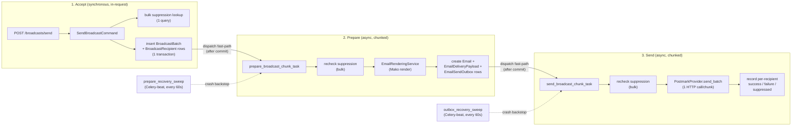
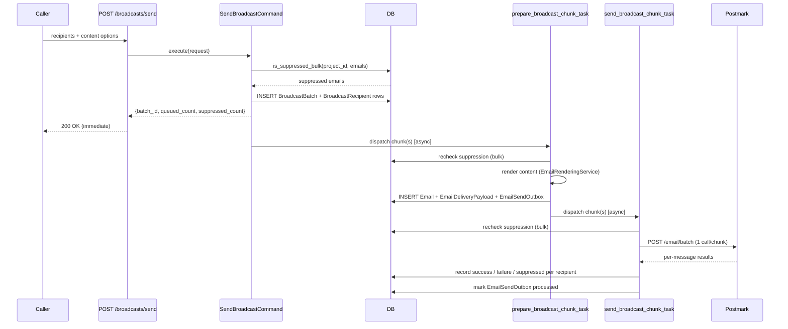
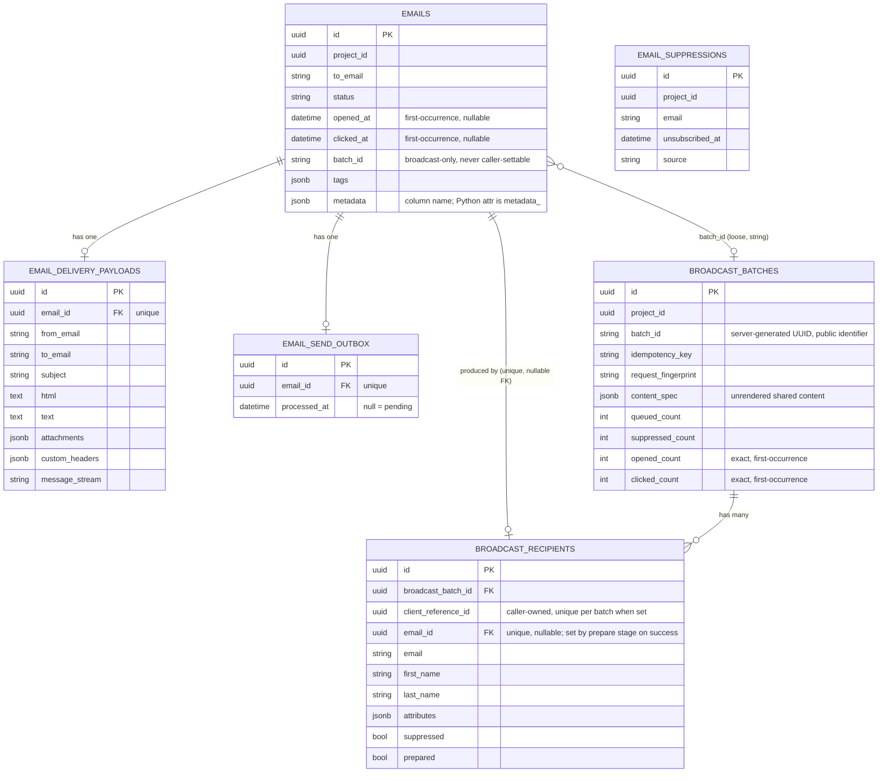
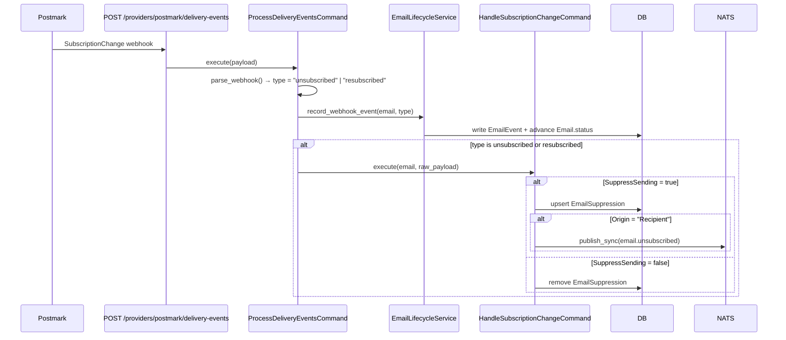
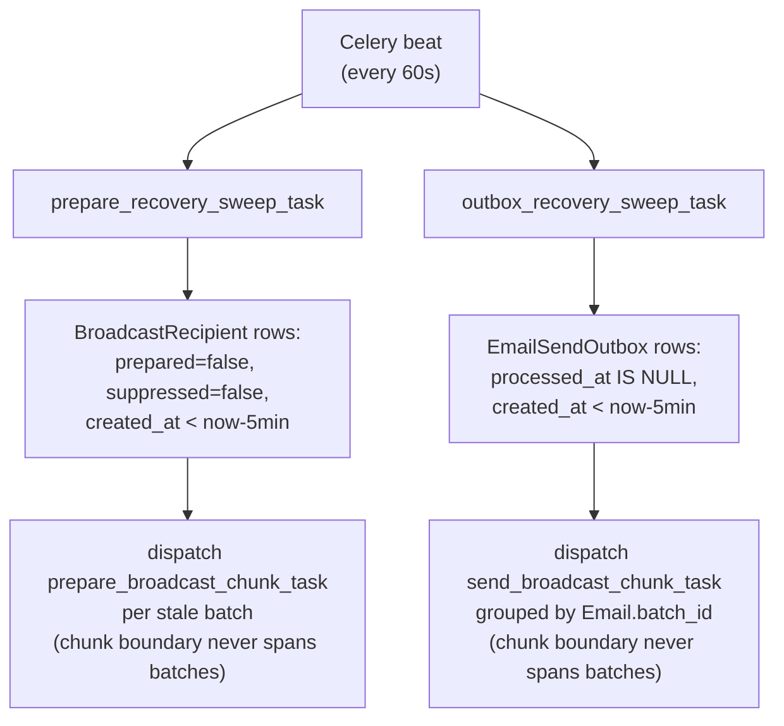

# Broadcast Sending

Sendly's broadcast feature fans a single piece of content out to a list of recipients in one API call (`POST /broadcasts/send`), with light per-recipient personalization, automatic skipping of unsubscribed recipients, and delivery via Postmark's Bulk API. Design rationale lives in [`docs/prds/0002-broadcast-sending.md`](prds/0002-broadcast-sending.md), [`docs/features/feat-001/feature.md`](features/feat-001/feature.md), and — for caller-supplied recipient references, recipient-to-email correlation, and click metrics — [`docs/prds/0004-broadcast-recipient-engagement-results.md`](prds/0004-broadcast-recipient-engagement-results.md); this page documents the resulting data flow and schema.

## API

### `POST /broadcasts/send`

```json
{
  "project_id": "5b8a...",
  "from_email": "news@example.com",
  "subject": "Hello ${first_name}",
  "html": "<p>Hi ${first_name}, ...</p>",
  "template_id": null,
  "template_alias": null,
  "template_variables": {},
  "custom_headers": {},
  "idempotency_key": "campaign-2026-07-launch",
  "tags": ["campaign-x"],
  "metadata": {"source": "crm"},
  "recipients": [
    {
      "email": "a@example.com",
      "first_name": "Alice",
      "attributes": {"plan": "Pro"},
      "client_reference_id": "9c3e...-uuid"
    },
    {"email": "b@example.com"}
  ]
}
```

`client_reference_id` is an optional, caller-owned `uuid` for correlating a submitted recipient with results later without matching mutable email addresses (see [Caller references](#caller-references) below). Omitting it (as `b@example.com` does above) keeps existing integrations working unchanged.

Returns immediately (before the prepare/send stages have run):

```json
{"batch_id": "b3f1...", "queued_count": 1, "suppressed_count": 1}
```

`cc`, `bcc`, `priority`, and `batch_id` are intentionally not accepted — Sendly generates `batch_id`, and `cc`/`bcc` have no coherent per-recipient meaning for a fan-out send.

### `GET /broadcasts/{batch_id}?project_id=...`

Accept-time counts plus live prepare-stage progress and engagement rollups:

```json
{
  "batch_id": "b3f1...",
  "queued_count": 1,
  "suppressed_count": 1,
  "prepared_count": 1,
  "finished": true,
  "delivered_count": 1,
  "bounced_count": 0,
  "complained_count": 0,
  "opened_count": 0,
  "clicked_count": 0
}
```

`opened_count`/`clicked_count` are exact first-occurrence counts (see [Engagement timestamps and counters](#engagement-timestamps-and-counters)) — unlike `opened_count` before this feature, neither is affected by out-of-order or duplicate webhook delivery.

### `GET /broadcasts/{batch_id}/recipients?project_id=...`

Paginated per-recipient results for one batch — the submitted identity, preparation/suppression outcome, resulting email (when one exists), and engagement timestamps, in one request instead of an N+1 series of `/emails` lookups:

```json
{
  "items": [
    {
      "id": "b6a1...",
      "client_reference_id": "9c3e...-uuid",
      "email": "a@example.com",
      "suppressed": false,
      "prepared": true,
      "email_id": "e0f2...",
      "email_status": "delivered",
      "opened_at": null,
      "clicked_at": null
    }
  ],
  "total": 1,
  "page": 1,
  "size": 50,
  "pages": 1
}
```

Ordered by `(created_at, id)` — a stable, unique tie-breaker so a consumer can page through an entire broadcast (via the standard `page`/`size` params) without skipping or duplicating recipients as the result set changes. A suppressed recipient or one whose preparation failed still appears, with `email_id`/`email_status`/`opened_at`/`clicked_at` all `null` — that distinguishes "suppressed"/"preparation failed" from "not yet prepared" (also visible via `prepared`), which matching by email address alone cannot do. Authorization follows the same batch-lookup-then-authorize pattern as `GET /broadcasts/{batch_id}`: it is checked against the batch's *actual* `project_id`, never a caller-supplied one, since the response includes recipient email addresses and engagement data.

Implemented by `BroadcastRecipientResultsService`, which owns the left join from `broadcast_recipients` to `emails` and reads only the denormalized `opened_at`/`clicked_at`/`status` columns — it never joins `email_events`, so one page's cost stays proportional to the page size requested, not to accumulated webhook history.

### `GET /emails?batch_id=...&tag=...`

The existing `/emails` listing, extended with `batch_id` (exact match) and `tag` (exact membership in the `tags` array) filters, so a broadcast's individual per-recipient delivery statuses can be queried the same way single-sent emails are.

## Configuration

| Setting | Env var | Default | Notes |
|---|---|---|---|
| `postmark_broadcast_stream_id` | `POSTMARK_BROADCAST_STREAM_ID` | `""` | Postmark's Broadcast message stream ID. Set on every broadcast's `EmailDeliveryPayload.message_stream`; single-sends leave this unset and use Postmark's default transactional stream. One global value — no per-project override. |
| `broadcast_chunk_size` | `BROADCAST_CHUNK_SIZE` | `100` | Recipients per prepare/send Celery task. Validated `<= 500` — Postmark's Bulk API (`POST /email/batch`) hard-caps a single call at 500 messages. |

## Idempotency

`SendBroadcastCommand` computes `request_fingerprint` as a SHA-256 hex digest over a canonical (sorted-keys) JSON dump of `{content_spec, recipients}`. On a request carrying an `idempotency_key`:

- **Key seen before, same fingerprint** → returns the original batch's `{batch_id, queued_count, suppressed_count}` without creating anything new.
- **Key seen before, different fingerprint** → `409 Conflict`.
- **Key not seen** → proceeds normally.

The `(project_id, idempotency_key)` partial unique index (non-null keys only) on `broadcast_batches` is the durable backstop for this check.

`client_reference_id` is part of the canonical recipient representation the fingerprint is computed over, so retrying an idempotency key with the *same* recipients but *changed* references is a fingerprint mismatch → `409 Conflict`, exactly like changing any other recipient field.

## Caller references

Each recipient in a `POST /broadcasts/send` request may carry an optional `client_reference_id` — a caller-owned `uuid`. Sendly persists it verbatim on the corresponding `BroadcastRecipient` row and returns it in `GET /broadcasts/{batch_id}/recipients` results, so a consumer (e.g. Looply) can correlate a submitted recipient with its outcome using an identifier it controls, rather than matching on the (mutable, possibly-duplicated) email address:

- **Optional and backward compatible.** Omitting it is a no-op; existing integrations are unaffected.
- **Unique per batch, when supplied.** `SendBroadcastCommand` rejects a request containing two recipients with the same non-null `client_reference_id` (`422`) before anything is persisted; the `(broadcast_batch_id, client_reference_id)` unique constraint on `broadcast_recipients` is the durable backstop (Postgres treats `NULL` as distinct, so recipients without a reference never collide with each other or with reused references in other batches).
- **Reusable across batches.** The same reference may appear in a different `POST /broadcasts/send` call; uniqueness is scoped to one batch, not globally.
- **No template semantics.** Unlike `attributes`, it is never merged into `template_variables`.

## Status values

`Email.status` (see `app/constants/email.py`): `queued → sent → delivered → opened/clicked`, or one of the terminal outcomes — `bounced`, `complained`, `dropped`, `failed`, `unsubscribed`, `suppressed`. Once an `Email` reaches a terminal status, `EmailLifecycleService` never overwrites it, even from a later out-of-order webhook. Status also never regresses within the non-terminal happy path (`sent → delivered → opened → clicked`): if a click webhook arrives before its open webhook for the same email, the later "opened" event does not move status back from `clicked` to `opened` — but it still records `opened_at` (see below). `suppressed` is written only by `EmailLifecycleService.record_send_suppressed`, called from `send_broadcast_chunk_task` when a recipient turns out to be suppressed at send time.

## Engagement timestamps and counters

`Email.opened_at`/`Email.clicked_at` each record the *earliest* known occurrence of that event for the email — not a log of every event (the full history is still in `email_events`; these are denormalized query fields for cheap per-recipient/per-batch reads). `EmailLifecycleService.record_webhook_event` sets each one via an atomic conditional `UPDATE ... WHERE <column> IS NULL`, so:

- A duplicate or concurrent webhook delivery for the same email can never set the timestamp twice, even under concurrent requests — Postgres's row lock serializes the two updates, and only the one that finds the column still `NULL` at commit time changes anything.
- The timestamp is recorded independently of `Email.status` — an out-of-order webhook that doesn't move status forward (see above) still records its engagement timestamp, so status ordering never discards evidence of engagement.
- A click never synthesizes an open: `clicked_at` and `opened_at` are only ever set by their own event type.

`BroadcastBatch.opened_count`/`clicked_count` are incremented once per email, on the same first-occurrence outcome (`WebhookOutcome.first_opened`/`first_clicked`) — a recipient with three clicked links, or a webhook retried five times, still counts as one clicked recipient.

## Why three stages

A naive implementation would render each recipient's content and call Postmark once per recipient, all inside the original HTTP request — that doesn't scale to large lists without risking a request timeout. Sendly splits the work into three stages so the only synchronous, in-request work is O(1) round-trips regardless of list size:

1. **Accept** (sync, in the HTTP request) — one bulk suppression lookup, one bulk insert of raw recipient data. No rendering, no `Email` rows yet.
2. **Prepare** (async, chunked) — renders each recipient's content and creates their `Email` row, delivery payload, and outbox entry.
3. **Send** (async, chunked) — sends a chunk's payloads to Postmark's Bulk API in one HTTP call and records each recipient's outcome.



Both dispatches follow the same two-trigger shape: a synchronous fast-path call immediately after the producing transaction commits, plus a periodic Celery-beat recovery sweep that picks up anything left behind by a crash between commit and dispatch.

## Request/response sequence



## Entity relationships



Note: `Email.batch_id` (a string) and `BroadcastBatch.batch_id` (the same string) are the *public* identifier used for querying (`GET /emails?batch_id=`, `GET /broadcasts/{batch_id}`). `BroadcastRecipient.broadcast_batch_id` is a real foreign key to `BroadcastBatch.id` (the internal UUID primary key) — the two `batch_id`-shaped names are intentionally different concepts; see [Naming](#naming) below.

## Entities

### `Email` (extended)

The existing per-recipient email row, extended with three broadcast-related columns. Every recipient of a broadcast gets exactly one `Email` row, created by the prepare stage — same status lifecycle (`queued → sent/failed/...`) and query surface (`GET /emails/{id}`) as single-send emails.

| Column | Type | Notes |
|---|---|---|
| `batch_id` | `string`, indexed | The owning broadcast's public `batch_id`. `NULL` for single-sends via `/emails`. Never caller-settable. |
| `opened_at` | `datetime`, nullable | Earliest known "opened" webhook for this email. Set once via an atomic conditional update — see [Engagement timestamps and counters](#engagement-timestamps-and-counters). |
| `clicked_at` | `datetime`, nullable | Same first-occurrence semantics as `opened_at`, for the "clicked" event. Independent of `opened_at` — a click never sets it. |
| `tags` | `jsonb` (array of strings) | Copied from the batch's `content_spec.tags` at prepare time. Also settable on single-send. |
| `metadata` | `jsonb` (object) | Copied from `content_spec.metadata`. Python attribute is `metadata_` — `metadata` is reserved on SQLAlchemy's declarative `Base` (it holds the schema's `MetaData` registry). |

Written by: `EmailRepository.create_email` (called from `prepare_broadcast_chunk_task` for broadcasts, `SendEmailCommand` for single-sends). Status transitions after creation go exclusively through `EmailLifecycleService`.

### `BroadcastBatch`

One row per accepted `POST /broadcasts/send` request — the durable idempotency authority and the source of the shared, *unrendered* content every recipient's `Email` is rendered from.

| Column | Type | Notes |
|---|---|---|
| `id` | `uuid` PK | Internal identifier; other tables FK to this. |
| `project_id` | `uuid` | Tenant scope. |
| `batch_id` | `string` | Server-generated UUID string — the *public* identifier callers use to query (`GET /broadcasts/{batch_id}`). Unique per `(project_id, batch_id)`. |
| `idempotency_key` | `string`, nullable | Caller-supplied. Unique per `(project_id, idempotency_key)` when non-null. |
| `request_fingerprint` | `string` | SHA-256 of the canonical `(content_spec, recipients)` payload — used to detect a retried idempotency key with *different* content (→ `409`). |
| `content_spec` | `jsonb` | The shared, not-yet-rendered content options (`html`/`text`/`template_id`/`template_alias`/`template_variables`/`subject`/`from_email`/`custom_headers`/`attachments`/`tags`/`metadata`). Stored as plain JSON, but the read/write boundary is the typed `app.schemas.broadcast.ContentSpec` — `SendBroadcastCommand` writes `ContentSpec.from_request(req).model_dump(mode="json")`, `prepare_broadcast_chunk_task` reads it back via `ContentSpec.model_validate(batch.content_spec)`. Avoids `dict.get("some_key")` string lookups scattered across the pipeline. |
| `queued_count`, `suppressed_count` | `int` | Fixed at accept time — the counts returned in the `POST /broadcasts/send` response and later re-shown by `GET /broadcasts/{batch_id}`. |
| `opened_count`, `clicked_count` | `int`, default `0` | Exact, first-occurrence rollups — incremented once per email via `BroadcastRepository.increment_engagement_counter`, driven by `WebhookOutcome.first_opened`/`first_clicked` rather than by `Email.status`. See [Engagement timestamps and counters](#engagement-timestamps-and-counters). |
| `delivered_count`, `bounced_count`, `complained_count` | `int`, default `0` | Rollups of the first time an email reaches that terminal-ish status — see `BroadcastRepository.increment_delivery_counter`. |

Written once by `SendBroadcastCommand`, in the same transaction as the batch's `BroadcastRecipient` rows. Never updated afterward.

### `BroadcastRecipient`

The raw, unrendered per-recipient data submitted with the request — one row per recipient, created in bulk by `SendBroadcastCommand` and consumed (and marked `prepared`) by `prepare_broadcast_chunk_task`. Distinct from `Email`: a suppressed recipient gets a `BroadcastRecipient` row but never an `Email` row.

| Column | Type | Notes |
|---|---|---|
| `broadcast_batch_id` | `uuid` FK → `broadcast_batches.id` | |
| `client_reference_id` | `uuid`, nullable | Caller-owned correlation id (see [Caller references](#caller-references)). Unique per `(broadcast_batch_id, client_reference_id)` when non-null. |
| `email_id` | `uuid` FK → `emails.id`, nullable, unique | The one `Email` this recipient produced, set by `prepare_broadcast_chunk_task` right after creating it. `NULL` for a suppressed recipient or a rendering failure — and, for broadcasts accepted before this relationship existed, for every historical row (never backfilled by matching addresses; see [Known limitations](#known-limitations)). This is also the unique recipient-to-email relationship the broadcast pipeline reliability design (`docs/prds/0003-broadcast-pipeline-reliability.md`) requires — it is not duplicated by that work. |
| `email`, `first_name`, `last_name` | `string` | `email` required; names optional. `email` is the immutable submitted address — never rewritten after acceptance. |
| `attributes` | `jsonb` | Arbitrary per-recipient personalization data, merged into `content_spec.template_variables` at render time. |
| `suppressed` | `bool` | Set from the bulk suppression lookup at accept time. Rows with `suppressed=true` are never dispatched to the prepare stage. |
| `prepared` | `bool` | Set once the prepare stage has processed the row (whether or not it produced an `Email` — a recipient suppressed *since* acceptance also gets `prepared=true` with no `Email` row). A recipient suppressed *at accept time* is never dispatched to prepare at all, so it stays `prepared=false` indefinitely — `GET /broadcasts/{batch_id}/recipients` is what lets a caller tell "suppressed" apart from "not yet prepared" for that row. |

`GET /broadcasts/{batch_id}`'s `prepared_count` is `COUNT(*) WHERE broadcast_batch_id = ? AND prepared = true`.

### `EmailDeliveryPayload`

The immutable, fully-resolved delivery payload for one `Email` — written once by the prepare stage, read verbatim by the send stage. Exists so the send stage never re-fetches a template or depends on request-only recipient data (both of which may have changed or vanished by send time).

| Column | Type | Notes |
|---|---|---|
| `email_id` | `uuid` FK → `emails.id`, unique | One payload per email. |
| `from_email`, `to_email`, `subject`, `html`, `text` | | Fully rendered — no further templating happens downstream. |
| `attachments`, `custom_headers` | `jsonb` | |
| `message_stream` | `string`, nullable | The configured Postmark broadcast stream ID for broadcasts; `NULL` for single-sends (Postmark's default transactional stream applies). |

Written by `prepare_broadcast_chunk_task`. Never updated.

### `EmailSendOutbox`

One pending-send marker per `Email`, consumed (chunked) by the send stage — the mechanism both the fast-path dispatch and the recovery sweep use to find work.

| Column | Type | Notes |
|---|---|---|
| `email_id` | `uuid` FK → `emails.id`, unique | |
| `processed_at` | `datetime`, nullable, indexed | `NULL` = pending. Set once `send_broadcast_chunk_task` has recorded a terminal outcome (success, failure, or suppressed) for the email. |

Written by `prepare_broadcast_chunk_task` (creation), updated by `send_broadcast_chunk_task` (`mark_processed`).

### `EmailSuppression`

A project-scoped recipient who has unsubscribed — checked (in bulk) at every stage of every future broadcast, and by `send_broadcast_chunk_task` as a final recheck immediately before sending.

| Column | Type | Notes |
|---|---|---|
| `project_id` | `uuid` | |
| `email` | `string` | Unique per `(project_id, email)`. |
| `unsubscribed_at` | `datetime` | |
| `source` | `string` | e.g. `postmark:Recipient`, `postmark:Admin`. |

Written/removed by `HandleSubscriptionChangeCommand`, driven by Postmark's `SubscriptionChange` webhook (see below) — never by the broadcast send path itself.

## Unsubscribe flow

Postmark's `SubscriptionChange` webhook is the only way a suppression is created or removed. `SuppressSending=true` distinguishes an unsubscribe from `SuppressSending=false` (a reactivation) — this is **not** a blanket "any SubscriptionChange = unsubscribed" mapping.



A `SubscriptionChange` with a null `MessageID` can't be resolved to an `Email`/`project_id` — `HandleSubscriptionChangeCommand` logs it for operations and skips the suppression mutation rather than guessing.

## Naming

Three different "batch id" concepts appear across this feature — worth being explicit about, since the names are easy to confuse:

| Name | Type | What it identifies |
|---|---|---|
| `BroadcastBatch.id` | `uuid` (PK) | Internal row identifier. What `BroadcastRecipient.broadcast_batch_id` actually references. |
| `BroadcastBatch.batch_id` / `Email.batch_id` | `string` | The *public* identifier — what callers pass to `GET /broadcasts/{batch_id}` and `GET /emails?batch_id=`. |
| `BroadcastRecipient.broadcast_batch_id` | `uuid` (FK) | Foreign key to `BroadcastBatch.id` — despite the similar name, this is **not** the same value as `BroadcastBatch.batch_id`. |

## Recovery sweeps

Both async stages dispatch synchronously right after their producing transaction commits — the periodic sweeps below exist only to catch rows left behind by a crash between commit and dispatch; they are not the normal path.



## Known limitations

- **No exactly-once guarantee across a crash mid-chunk.** `prepare_broadcast_chunk_task` commits each recipient's `Email`/payload/outbox rows individually rather than as one transaction for the whole chunk, and `BroadcastRecipient.prepared` is only set once, after the loop finishes. If the task dies partway through, already-created rows for earlier recipients stay `prepared=false` — the recovery sweep will re-dispatch them and duplicate those rows (a real send, twice). The recovery sweeps also have no "claimed" marker, so a slow-but-healthy chunk task that outlives the 5-minute grace period can be re-dispatched by the sweep while still in flight.
- **Accepted, separate risk**: a whole-chunk retry on a Postmark transport failure (not the crash case above) can double-send a subset of a chunk, since the Bulk API has no per-message idempotency key. This one is an intentional trade-off from the original design (see the PRD's Further Notes), not a bug.
- A fix for the first limitation — durable claim tokens/leases on `broadcast_recipients` and `email_send_outbox`, atomic per-chunk transactions, and a unique constraint tying an `Email` to the `broadcast_recipient` that produced it — is specified but not yet implemented; see [`docs/prds/0003-broadcast-pipeline-reliability.md`](prds/0003-broadcast-pipeline-reliability.md).
- `Email.to_email` only stores the first address even for a multi-recipient single-send `to` list (Postmark itself now receives all of them, comma-joined) — tracked in [issue #82](https://github.com/tesserahq/sendly/issues/82). Not applicable to broadcasts, where every recipient already gets its own `Email` row.
- **Historical broadcasts have no recipient-to-email link.** `broadcast_recipients.email_id` only started being populated for broadcasts accepted after this relationship was introduced ([`docs/prds/0004-broadcast-recipient-engagement-results.md`](prds/0004-broadcast-recipient-engagement-results.md)). It is deliberately *not* backfilled by matching `email` addresses — duplicate addresses within one batch are valid, so an address-based backfill could link a recipient to the wrong email. `GET /broadcasts/{batch_id}/recipients` still returns pre-existing rows, but with `email_id`/`email_status`/`opened_at`/`clicked_at` all `null`; the full per-recipient correlation contract only holds for broadcasts accepted after rollout. The one-time migration backfill that *is* safe — `Email.clicked_at` from the earliest existing `clicked` event per email, and `opened_count`/`clicked_count` recomputed from first-occurrence timestamps — doesn't depend on address matching and applies to all historical data.
