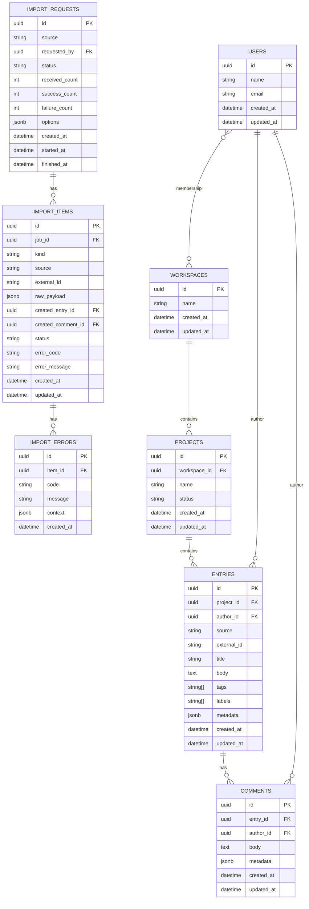

# Sendly Design Document

## Overview

For managers, understanding the real state of a project is often difficult. For executives overseeing multiple projects, it is even harder. Each team may use different tools and ways of managing work, and keeping track requires jumping between 10 or more services. This fragmentation makes it nearly impossible to get a clear, timely view of progress across the organization.

**Sendly** provides a transparent layer that organizes and simplifies the information you need, when you need it. The goal is to deliver clear project updates and summaries to different parts of the organization without requiring people to jump between tools.

## Core Concepts

Sendly’s data model is structured around a few key entities:

- **Users**: Represent the people interacting with the system.
- **Memberships**: Represent the relationship between users and workspaces.
- **Workspaces**: The top-level organizational unit.
  - **Projects**: Groupings of related work inside a workspace.
  - **Entries**: The core unit of information aggregated from external sources.
    - **Entry Updates**: Discussion and activity attached to an entry.
- **ImportJobs**: Represent each request to bring external data into Sendly.
- **ImportItemsCommand**: Individual entries or entry_updates submitted as part of an import job.
- **ImportErrors**: Capture validation or processing errors for failed import items.

## Entity Relationships



### Entries

Entries represent data coming from external systems like Jira tickets, GitHub issues, or GitHub pull requests. Each entry has a set of common attributes:

- `id`
- `title`
- `body`
- `source` (e.g., Jira, GitHub)
- `author`
- `tags`
- `labels`
- `created_at`
- `updated_at`

In addition to these shared fields, entries can include an `extra_fields` or `metadata` column. This allows the system to store source-specific information while maintaining a unified structure across all entries.

### Entry Updates

Entry Updates capture conversations and activity attached to an entry. Like entries, they contain common attributes (id, body, author, timestamps) along with a `metadata` field for source-specific details.

### Idempotency

Imports are idempotent by `(source, external_id)`. When `options.upsert=true`, existing entries and entry updates are updated in place; otherwise duplicates are skipped and reported as failed with `code=duplicate`.

## Purpose

## Data Intake (Imports)

Sendly accepts external data through a queued import flow. This avoids blocking callers and allows heavy normalization to run asynchronously.

### API

**Create import**

`POST /imports`

Body accepts either a single entry or a collection with entry_updates.

```json
{
  "source": "github_issue",
  "requested_by": "user-uuid",
  "entries": [
    {
      "external_id": "org/repo#1234",
      "title": "Fix pagination bug",
      "body": "…",
      "author": "octocat",
      "tags": ["bug", "api"],
      "labels": ["priority:high"],
      "created_at": "2025-09-01T10:00:00Z",
      "updated_at": "2025-09-02T12:00:00Z",
      "entry_updates": [
        {"external_id": "c1", "body": "Repro attached", "author": "qa", "created_at": "2025-09-01T11:00:00Z"}
      ],
      "metadata": {"repo": "org/repo"}
    }
  ],
  "options": {"upsert": true}
}
```

**Response**

`202 Accepted`

```json
{
  "id": "impt_01HXYZ…",
  "status": "queued"
}
```

**Check status**

`GET /imports/{id}` returns:

```json
{
  "id": "impt_01HXYZ…",
  "status": "processing", // queued | processing | completed | failed | partial
  "counts": {"received": 10, "succeeded": 9, "failed": 1},
  "errors": [
    {"item_id": "impi_01…", "code": "validation_error", "message": "missing title"}
  ],
  "started_at": "2025-09-05T12:00:00Z",
  "finished_at": null
}
```

### Storage model

We persist import jobs and each submitted item to provide traceability and retries.

- **ImportJob**: one per request to `/imports`.
- **ImportItem**: one per entry (and optionally per entry_update) inside a job.
- **ImportError**: optional error rows for failed items.

### States

`queued → processing → completed | partial | failed`

- **completed**: all items succeeded.
- **failed**: all items failed.
- **partial**: some items succeeded while others failed (mixed outcome).


Retries are idempotent. Upserts are controlled by `options.upsert` and `external_id + source`.

By unifying updates from multiple tools into entries and entry_updates, Sendly makes it easier to see progress, discussions, and context in one place. This enables project summaries and updates to be shared across the organization without requiring deep knowledge of each individual system.
